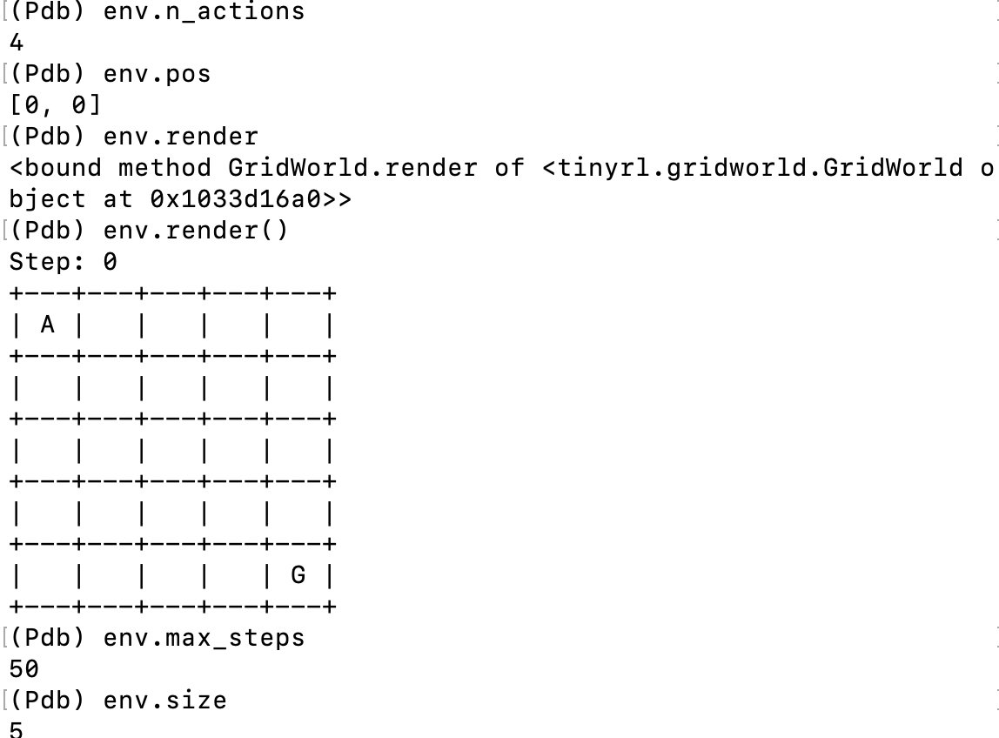

I went back to the basics this past weekend to sit down and implement basic reinforcement learning algorithms from scratch, focusing on policy gradient methods, starting with REINFORCE, then PPO, then GRPO. I focused on a small environment setup: GridWorld, where the policy's objective is to find an optimal path from the top left corner of a grid to the bottom right corner. At each, discrete, step, it receives a reward of $-10$ if it is not in the goal state and a reward of $1$ if it is. Along the way, I ended up building my own mini rl env toolkit called [tinyrl](https://github.com/rosikand/tinyrl)---check it out! 

## The setup

- We have an agent in an environment. At each step, the agent sees a state $s$, picks an action $a$, gets a reward $r$, and lands in a new state. An episode is a sequence of these interactions until done.
- The agent picks actions according to a policy at each state. Right now we have a random policy picks uniformly. We want a learned policy that picks good actions.
- Here's the key question: what does "good" mean?
    - We define an objective function $J$: the expected total reward over an episode. We use expectation since we want to optimize across all the episodes, not just one. We want to find the policy that maximizes $J$.
    - So the problem is: we have a function $J$ (expected total reward), it depends on how we pick actions (the policy), and we want to adjust the policy to make $J$ as large as possible.

## A lay of the land

- What does the policy $\pi_\theta(a_t \mid s_t)$ even mean? It says, at each state, we have its own probability distribution. Maybe at $(0,0)$ it is $\left[0.02, 0.60, 0.35, 0.03\right]$, meaning "mostly go right or down" (which makes sense, since the goal is at $(4,4)$). At $(4,3)$ it might be $\left[0.01, 0.95, 0.02, 0.02\right]$, meaning "almost certainly go right" (one step from the goal). For the random policy, it is the same distribution at every state: $\left[0.25, 0.25, 0.25, 0.25\right]$. Equal chance of each action.
- At each step, the agent looks at its current state, gets the probability vector from the policy, and samples one action from that distribution. Note: since it is probabilistic, it is not deterministic at each state.

<!-- <div style="text-align: center;">    </div> -->

## Optimization 

- We want to optimize $J(\theta) = \mathbb{E}[\text{total reward}]$ via gradient ascent.
- What makes computing $\nabla_\theta J$ harder than a standard gradient in supervised learning?


An episode is a **trajectory**: a sequence of state, action, reward tuples. For example: $(s_0, a_0, r_0), (s_1, a_1, r_1), \dots, (s_T, a_T, r_T)$. The total reward is just the sum of all the $r_t$ values in that sequence.

The probability of a specific trajectory comes from two things multiplied together at every step:

1. **The policy** $\pi_\theta(a_t \mid s_t)$: the probability *we* chose action $a_t$ at state $s_t$. We control this.

2. **The environment dynamics** $P(s_{t+1} \mid s_t, a_t)$: the probability the environment transitioned to $s_{t+1}$ after we took $a_t$. We don't control this. In our grid world, this is deterministic, so it is always $1$ or $0$.

The probability of a full trajectory is the product of all these at each step. That product defines a distribution over all possible trajectories. Each trajectory maps to a total reward. So we get a distribution over total rewards.

When we change $\theta$, we change $\pi_\theta$, which changes the trajectory distribution, which changes the distribution of total rewards, which changes $J$.

**The punchline:** we only control half of what generates a trajectory. We control action selection ($\pi_\theta$), but not the environment dynamics ($P$). This is exactly what makes computing $\nabla_\theta J$ tricky, and it is what the log-derivative trick will solve for us.

So, back to the question: we want $\nabla_\theta J$ to do gradient ascent. In supervised learning, you can backprop through the entire computation. Here, part of the computation (the environment) is a black box. How do you take a gradient through something you cannot differentiate?

## Math 

More formally: 

Let a trajectory $\tau$ be:

$$
\tau = (s_0, a_0, r_0, s_1, a_1, r_1, \dots, s_T, a_T, r_T)
$$

The probability of this specific trajectory under policy $\pi_\theta$ is:

$$
P(\tau \mid \theta) = p(s_0)\prod_{t=0}^{T} \left[ \pi_\theta(a_t \mid s_t)\, P(s_{t+1} \mid s_t, a_t) \right]
$$

Breaking that apart:

- $p(s_0)$: the starting state distribution. For us, this is always $(0,0)$, so this is $1$.
- $\pi_\theta(a_t \mid s_t)$: the probability our policy picked action $a_t$ at state $s_t$. **We control this.**
- $P(s_{t+1} \mid s_t, a_t)$: the probability the environment moved to $s_{t+1}$. **We do not control this.**

The total reward for a trajectory is:

$$
R(\tau) = \sum_{t=0}^{T} r_t
$$

Our objective is the expected total reward over all possible trajectories:

$$
J(\theta) = \mathbb{E}_{\tau \sim P(\tau \mid \theta)}[R(\tau)]
= \sum_{\tau} P(\tau \mid \theta)\, R(\tau)
$$

So when we take $\nabla_\theta J$, we are differentiating:

$$
\nabla_\theta J
= \nabla_\theta \sum_{\tau} P(\tau \mid \theta)\, R(\tau)
= \sum_{\tau} R(\tau)\, \nabla_\theta P(\tau \mid \theta)
$$

Here, $R(\tau)$ is just a number, since it is the sum of rewards along the trajectory, so it does not depend on $\theta$.

But $\nabla_\theta P(\tau \mid \theta)$ is the hard part, because $P(\tau \mid \theta)$ contains the environment dynamics $P(s_{t+1} \mid s_t, a_t)$ inside the product. At first glance, it seems like we would need to differentiate through the environment.

This is where the log-derivative trick comes in.


### The log derivative trick 


In supervised learning, you have a loss like $L = (\operatorname{model}(x) - y)^2$. Every piece of that computation is a differentiable function you wrote: the model is your neural net, the loss is a formula, and you can chain-rule through the entire thing from $L$ back to the parameters. The computation graph is fully yours.

In RL, think about what the "computation" looks like for one episode:

1. Policy sees state $s_0$, outputs distribution, **samples** action $a_0$
2. **Environment** receives $a_0$, returns $s_1$ and $r_0$
3. Policy sees $s_1$, outputs distribution, **samples** action $a_1$
4. **Environment** receives $a_1$, returns $s_2$ and $r_1$
5. ... and so on

Two problems jump out:

**The environment is a black box.** Steps 2 and 4 happen inside the environment. You do not have a formula for "how does the grid world compute the next state." You just call `env.step(action)` and get a result. There is no computation graph to backprop through. It is like trying to take the derivative of a function where half the operations happen inside a locked room.

**Sampling breaks the gradient flow.** Even on your side, the policy outputs a probability distribution, but then you *sample* a discrete action from it. "I rolled a 3" is not a differentiable operation. You can differentiate the probabilities $\left[0.25, 0.35, 0.25, 0.15\right]$, but the act of drawing a sample from them is a discontinuous step.

So the gradient of $J$ with respect to $\theta$ has to somehow go through (a) a sampling operation and (b) an unknown environment. You cannot just backprop.

**This is exactly what the log-derivative trick solves.** It rearranges the math so that the gradient only touches $\log \pi_\theta(a \mid s)$, which is entirely your policy, entirely differentiable. The environment and the sampling get absorbed into the expectation, which you estimate by just... running episodes.


## The Log-Derivative Trick

We left off here: we want $\nabla_\theta J$, but we cannot backpropagate through the environment. Let us start from the definition of $J$ and see how the math rescues us.

**Line 1: The definition of $J$.**

$$
J(\theta) = \sum_{\tau} P(\tau \mid \theta)\, R(\tau)
$$

This says: sum over all possible trajectories $\tau$, weight each by its probability under our policy, and multiply by its total reward. That is exactly what “expected total reward” means.

**Line 2: Take the gradient.**

$$
\nabla_\theta J = \sum_{\tau} R(\tau)\, \nabla_\theta P(\tau \mid \theta)
$$

Here, $R(\tau)$ is just a number, since it is the sum of rewards from that trajectory, so it does not depend on $\theta$. The gradient only acts on $P(\tau \mid \theta)$.

But $P(\tau \mid \theta)$ contains the environment dynamics inside it, so at first glance we seem stuck.

**Line 3: The trick.** Multiply and divide by $P(\tau \mid \theta)$:

$$
\nabla_\theta P(\tau \mid \theta)
=
P(\tau \mid \theta)\,
\frac{\nabla_\theta P(\tau \mid \theta)}{P(\tau \mid \theta)}
$$

Why would we do something that looks so silly? Because there is a useful calculus identity:

$$
\frac{\nabla f}{f} = \nabla \log f
$$

So we can rewrite:

$$
\frac{\nabla_\theta P(\tau \mid \theta)}{P(\tau \mid \theta)}
=
\nabla_\theta \log P(\tau \mid \theta)
$$

Therefore,

$$
\nabla_\theta P(\tau \mid \theta)
=
P(\tau \mid \theta)\, \nabla_\theta \log P(\tau \mid \theta)
$$

Substituting this back into the gradient of $J$ gives:

$$
\nabla_\theta J
=
\sum_{\tau} R(\tau)\, P(\tau \mid \theta)\, \nabla_\theta \log P(\tau \mid \theta)
$$

This is the key move.

**Question:** We started with $\nabla_\theta P(\tau \mid \theta)$, which was hard because $P(\tau \mid \theta)$ contains the environment dynamics. We have now rewritten it as

$$
P(\tau \mid \theta)\, \nabla_\theta \log P(\tau \mid \theta)
$$

Why might taking the gradient of the **log** of $P$ help us get rid of the environment dynamics?

Think about what the logarithm does to a product.

## Implementation: Naive forward pass (no backprop)

Before we get to the backwards pass, let's just focus on the implementing the forward pass first. 

We have our `tinyrl` policy skeleton: 

```python
# naive forward pass (no backprop)

class PolGrad(Policy):
    """PolGrad from scratch for grid world env"""

    def __init__(self, state_dim, n_actions):
        self.state_dim = state_dim
        self.n_actions = n_actions

    def __call__(self, obs):
        # random for now 
        return PolicyOutput(
            action=np.random.randint(self.n_actions),
            entropy=np.random.randint(self.n_actions)
        )
```


Define the policy $\theta$ as a table of probabilities:


We have $25$ states (each cell in the $5 \times 5$ grid) and $4$ actions. Our policy needs to output a probability distribution over actions for each state. So we need a $25 \times 4$ table.

Each entry in the table is a **logit**: just a raw number, unconstrained. To turn a row of logits into probabilities, we apply softmax. 

Steps: 

1. Initialize a $25 \times 4$ numpy array of zeros. All logits equal means uniform distribution, which is our random policy.
2. Write a function that takes a row of logits and returns probabilities: softmax.
3. Sample an action from those probabilities.


Solution: 

```python
# naive forward pass (no backprop)

class PolGrad(Policy):
    """PolGrad from scratch for grid world env"""

    def __init__(self, state_dim, n_actions, env_size):
        self.state_dim = state_dim
        self.n_actions = n_actions
        self.env_size = env_size
        
        self.theta = np.zeros((env_size * env_size, n_actions))
        pprint(self.theta.shape)


    def _state_to_idx(self, obs):
        row = int(round(obs[0] * (self.env_size - 1)))
        col = int(round(obs[1] * (self.env_size - 1)))
        return row * self.env_size + col

    def get_logits(self, idx):
        return self.theta[idx]

    def softmax(self, logits):
        return np.exp(logits) / np.sum(np.exp(logits))

    def entropy(self, probs):
        return -np.sum(probs * np.log(probs))

    def sample_action(self, probs):
        # sample action from state distribution
        # note: not using argmax for training, only for eval
        return np.random.choice(probs.size, p=probs)

    def __call__(self, obs):
        idx = self._state_to_idx(obs)
        logits = self.get_logits(idx)
        probs = self.softmax(logits)
        entropy = self.entropy(probs)
        action = self.sample_action(probs)
        
        return PolicyOutput(
            action=action,
            entropy=entropy
        )
```


and that is it. That is the forward pass. 


## Scratchpad 


Let a trajectory $\tau$ be:

$$
\tau = (s_0, a_0, r_0, s_1, a_1, r_1, \dots, s_T, a_T, r_T)
$$

The probability of this specific trajectory under policy $\pi_\theta$ is:

$$
P(\tau \mid \theta) = p(s_0)\prod_{t=0}^{T} \left[ \pi_\theta(a_t \mid s_t)\, P(s_{t+1} \mid s_t, a_t) \right]
$$

Breaking that apart:

- $p(s_0)$: the starting state distribution. For us, this is always $(0,0)$, so this is $1$.
- $\pi_\theta(a_t \mid s_t)$: the probability our policy picked action $a_t$ at state $s_t$. **We control this.**
- $P(s_{t+1} \mid s_t, a_t)$: the probability the environment moved to $s_{t+1}$. **We do not control this.**

The total reward for a trajectory is:

$$
R(\tau) = \sum_{t=0}^{T} r_t
$$

Our objective is the expected total reward over all possible trajectories:

$$
J(\theta) = \mathbb{E}_{\tau \sim P(\tau \mid \theta)}[R(\tau)]
= \sum_{\tau} P(\tau \mid \theta)\, R(\tau)
$$

So when we take $\nabla_\theta J$, we are differentiating:

$$
\nabla_\theta J
= \nabla_\theta \sum_{\tau} P(\tau \mid \theta)\, R(\tau)
= \sum_{\tau} R(\tau)\, \nabla_\theta P(\tau \mid \theta)
$$

Here, $R(\tau)$ is just a number, since it is the sum of rewards along the trajectory, so it does not depend on $\theta$.

But $\nabla_\theta P(\tau \mid \theta)$ is the hard part, because $P(\tau \mid \theta)$ contains the environment dynamics $P(s_{t+1} \mid s_t, a_t)$ inside the product. At first glance, it seems like we would need to differentiate through the environment.

This is where the log-derivative trick comes in.

*To be continued another day...* 